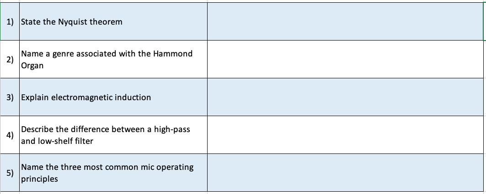
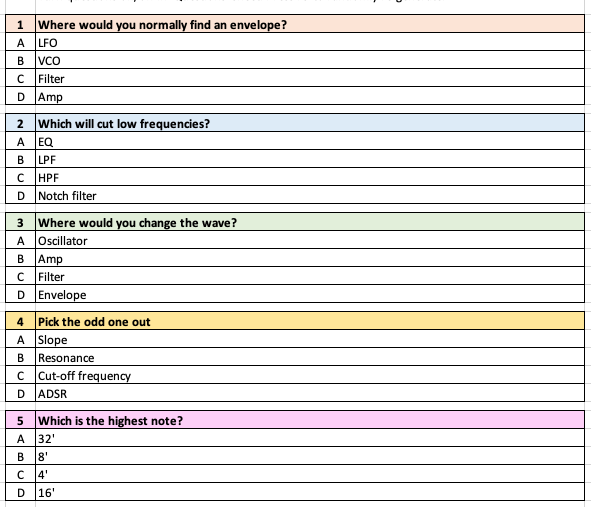
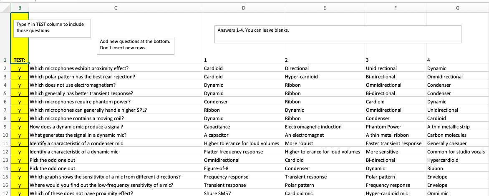

# Teacher Tools
{: .no_toc}

<!-- No TOC needed if ## Overview
- TOC
{:toc}
-->

## Overview

| Tool | Usage | Download  |
| ---- | -------- | ----- |
| [Retrieval Roulette](#roulette) | Questions and Answers generate random test. Pick entire topic(s) to include. | [Download](roulette.xlsx) |
| [MCQ Machine](#mcq) | Questions and Multiple-Choice Answers generate random test. Pick questions to include.  | [Download](MCQMachine.xlsx) |
| [Vocab Roulette](#vocab) | Terms and definitions generate random test. Pick vocabulary to include. | [Download](VocabRoulette.xlsx) |

## Retrieval Roulette {#roulette}

[Download Roulette here](roulette.xlsx).

The spreadsheet is a bank of questions and answers from which a random quiz is automatically constructed.

It supports retrieval practice and spaced repetition: questions from previous and current topics are mixed up randomly (at your control).

### Features

1. **Questions** sheet holds all the questions and answers (and the topic they fall under).
2. **Options** sheet selects which topics to include in the test.
3. **1_Q** sheet asks 1 question.
4. **5_Q** asks 5 questions. (**5_A** shows answers).
5. **10_Q** asks 10 questions. (**10_A** shows answers).
4. **Print Q** fills an A4 paper with questions, for homework or test. (**Print_A** shows answers)
5. **Print KO** randomly hides questions and answers, like a deletion test in a Knowledge Organiser. (**Print_A** shows answers)

Adapted from the example and information in [Adam Boxer's blog](https://achemicalorthodoxy.wordpress.com/2018/08/18/retrieval-roulettes/). Links to many different examples at the bottom.

### Instructions

Written and video instructions to follow.

## MCQ Machine {#mcq}

[Download MCQ Machine here](MCQmachine.xlsx).

The MCQ machine generates five multiple-choice questions from a list. You turn individual questions on or off in the **Questions** sheet and Excel will randomly choose five. The order of the responses are also randomised.

### Instructions

Instructions in the Excel file.

### Tips

* You can leave rows blank or add headings to organise topics/weeks etc.
* Select a number of the yellow cells, then press Ctrl+Enter to type 'Y' into many cells at once (for example to select questions for an entire topic).

Thoughts on writing [high-quality MCQs](https://testing.byu.edu/handbooks/14%20Rules%20for%20Writing%20Multiple-Choice%20Questions.pdf).

## Vocab Roulette {#vocab}

[Download Vocab Roulette here](VocabRoulette.xlsx).

10-question vocabulary tests from a spreadsheet of terms and definitions.

### Features

1. **Glossary** sheet holds terms and definitions. 
	* Type Y to turn individual terms on/off.
	* (Optional) Type X to include difficult terms as potential 'extra' questions, e.g. for differentiation.
2. **Terms** tests students' definitions.
3. **Definitions** tests students' terms.
4. **Answers** shows both.
5. **Gaps** deletes every other term or definition.
6. **Terms (ext)** and **Definitions (ext)** ask 7 normal questions and 3 'extra' questions (e.g. harder terms for differentiation or for more recent topics covered...). **Answers (ext)** shows answers.