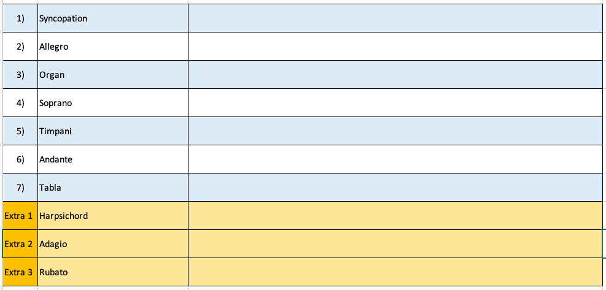

# Excel tools
{: .no_toc}

- TOC
{:toc}

## Overview

| Tool | Usage |
| ---- | ----- |
| [Retrieval Roulette](#roulette) | Questions and Answers generate random test. Pick entire topic(s) to include. |
| MCQ Machine | Questions and Multiple-Choice Answers generate random test. Pick questions to include.  |
| Vocab Roulette | Terms and definitions generate random tests. Pick vocabulary to include. |

## Retrieval Roulette {#roulette}

[Download Roulette here](roulette.xlsx).

The spreadsheet is a bank of questions and answers from which a random quiz is automatically constructed.

It supports retrieval practice and spaced repetition: questions from previous and current topics are mixed up randomly (at your control).

### Features

1. **Questions** sheet holds all the questions and answers (and the topic they fall under).
2. **Options** sheet selects which topics to include in the test.
3. **1_Q** sheet asks 1 question.
4. **5_Q** asks 5 questions. 
	* **5_A** are the answers.
5. **10_Q** asks 10 questions. 
	* **10_A** are the answers.
4. **Print Q** fills an A4 paper with questions, for homework or test.
	* **Print_A** are the answers.
5. **Print KO** randomly hides questions and answers, like a deletion test in a Knowledge Organiser. 
	* (The answers are in previous sheet **Print A**.)

### Screenshots

Adapted from the example and information in [Adam Boxer's blog](https://achemicalorthodoxy.wordpress.com/2018/08/18/retrieval-roulettes/). Links to many different examples at the bottom.

### Instructions

Written and video instructions to follow.

## MCQ Machine

[Download MCQ Machine here](MCQmachine.xlsx).

The MCQ machine generates five multiple-choice questions from a list. You turn individual questions on or off in the **Questions** sheet and Excel will randomly choose five. The order of the responses are also randomised.

### Instructions

Instructions in the Excel file.

### Tips

* You can leave rows blank or add headings to organise topics/weeks etc.
* Select a number of the yellow cells, then press Ctrl+Enter to type 'Y' into many cells at once (for example to select questions for an entire topic).

Thoughts on writing [high-quality MCQs](https://testing.byu.edu/handbooks/14%20Rules%20for%20Writing%20Multiple-Choice%20Questions.pdf).

## Vocab Roulette

An adaptation to a Roulette based on single-word KS4 glossary.

In the **Glossary** sheet, toggle single terms on and off with 'Y'.

Optional 'extra' questions can be specified with 'X'. These appear as the final 3 questions of a 10-question quiz.

